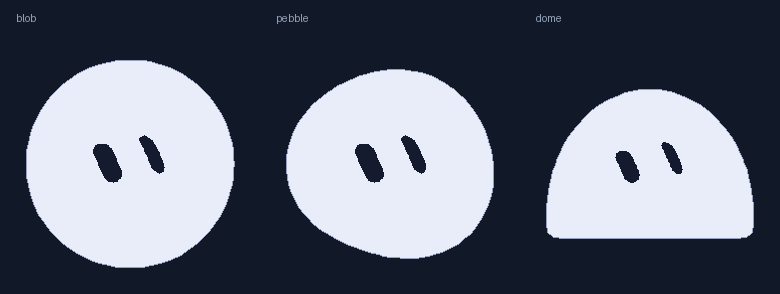

# DeepSeek 余额悬浮窗

Windows 桌面上一张常驻的小卡片：实时显示 DeepSeek 账户余额，右下角趴着一只会自己做表情的吉祥物，它同时就是刷新键。

纯 Python 标准库（tkinter）实现，**不需要安装任何第三方库**。窗口无边框、可拖动、可置顶，尺寸固定 219×103 像素。


## 功能

- **实时余额** —— 调用 DeepSeek 官方 `GET /user/balance` 接口，默认每 60 秒自动刷新一次
- **吉祥物就是刷新键** —— 右下角的小球平时会眨眼、缓慢变形、眼珠跟着鼠标走；点一下立即刷新——请求中变成「思考」表情（带一圈转动的弧），成功变「庆祝」，失败变「困惑」
- **余额走势** —— 卡片底部一条迷你曲线，画出最近一天的余额变化
- **今日已用** —— 曲线右侧显示今天累计用了多少钱；如果是充值导致余额上升，会变成绿色的「今日充值」
- **拖动 + 记忆位置** —— 按住卡片任意位置即可拖动，位置自动保存，下次启动还在原地
- **右键菜单** —— 立即刷新 / 设置 API Key / 复制余额 / 窗口置顶 / 开机自动启动 / 退出
- **错误可见** —— 网络异常或 Key 失效时标题行变红说明原因，并保留上一次的余额继续显示

## 运行环境

- Windows 10 / 11
- Python 3.9 及以上（用官方安装包即可，tkinter 已自带）
- 不需要 `pip install` 任何东西

## 快速开始

### 1. 启动

双击 `启动悬浮窗.vbs`（用 `pythonw` 启动，不会弹出黑色命令行窗口）。

也可以直接运行：

```powershell
python deepseek_balance_widget.py
```

### 2. 填入 API Key

第一次启动会弹窗让你填 DeepSeek API Key——在 <https://platform.deepseek.com/api_keys> 免费创建，形如 `sk-...`。

也可以在 `config.json` 里预先写好，或者用命令行临时指定：

```powershell
python deepseek_balance_widget.py --key sk-xxxx
```

Key 只保存在本机 `config.json`，该文件已在 `.gitignore` 里排除，不会被提交到仓库。

### 3. 摆到顺手的位置

按住卡片任意位置拖动即可。想固定在最上层，右键勾选「窗口置顶」。

## 操作说明

- **点吉祥物 = 手动刷新**，它脸上的表情会告诉你这次刷新成没成
- **按住卡片拖动 = 移动窗口**（按住吉祥物拖动也一样；移动超过 6 像素才判定为拖动，所以正常点击不会误拖）
- **右键卡片 = 打开菜单**

## 配置项

`config.json`：

| 字段 | 说明 | 默认值 |
| --- | --- | --- |
| `api_key` | DeepSeek API Key | 空 |
| `refresh_interval_seconds` | 自动刷新间隔（秒，最小 5） | 60 |
| `topmost` | 是否保持窗口置顶 | true |
| `window_position` | 窗口位置，拖动后自动保存 | 屏幕右上角 |

另外会生成一个 `config.history.json`，记录余额采样点（每 5 分钟至少一笔），用来计算「今日已用」。这两个文件都不会入库。

## 开机自动启动

```powershell
powershell -ExecutionPolicy Bypass -File install_autostart.ps1
```

取消自启：

```powershell
powershell -ExecutionPolicy Bypass -File remove_autostart.ps1
```

也可以直接右键卡片 →「开机自动启动」。

## 命令行参数

```powershell
python deepseek_balance_widget.py --key sk-xxxx      # 临时指定 Key
python deepseek_balance_widget.py --interval 30      # 30 秒刷新一次
python deepseek_balance_widget.py --url <接口地址>    # 自定义余额接口
python deepseek_balance_widget.py --demo             # 离线演示数据
```

## 文件说明

| 文件 | 说明 |
| --- | --- |
| `deepseek_balance_widget.py` | 主程序，单文件 |
| `grokbot_mascot_data.py` | 吉祥物的几何数据（由脚本生成，见下） |
| `tools/build_mascot_data.py` | 重新生成上面那份数据的脚本 |
| `启动悬浮窗.vbs` | 无黑框启动 |
| `install_autostart.ps1` / `remove_autostart.ps1` | 开机自启开关 |
| `config.example.json` | 配置示例 |
| `docs/expressions.png` | 25 套眼睛表情一览 |
| `docs/round-shapes.png` | 当前用到的 3 种身体形状 |

## 关于吉祥物

吉祥物不是图片，全部由 tkinter 的 Canvas 实时绘制，所以既不需要任何图片资源，也不依赖浏览器引擎。

它的造型数据来自 Grok Bot 公开前端的几何数据：25 套眼睛表情、18 种身体轮廓，以及每个状态各自的眨眼间隔、换表情间隔和表情池。本版本挑用了其中偏圆的 3 种形状（正圆 / 扁圆 / 半圆），在空闲、刷新中、成功、失败四种状态之间切换。




想换形状或加表情，改 `tools/build_mascot_data.py` 里的 `KEEP_SHAPES` / `KEEP_STATES`，重新跑一遍脚本即可。

> **第三方内容说明**：`grokbot_mascot_data.py` 里的几何数据提取自 x.ai/bot 的公开前端（经 [iduu/grokbot-animation](https://github.com/iduu/grokbot-animation) 整理），版权归原作者所有，**不在本项目的 MIT 授权范围内**，仅供学习研究。仓库中其余代码均由本项目作者编写，按下面的 MIT 协议授权。

## 常见问题

- **显示「API Key 无效（401）」**：Key 填错或已被删除，去 api_keys 页面重新生成一个
- **显示「网络超时」/「网络连接失败」**：检查网络或代理设置
- **双击 vbs 没反应**：确认 Python 已安装并加入 PATH，或直接运行 `python deepseek_balance_widget.py` 看报错
- **卡片不见了**：多半是被拖到屏幕外了，删掉 `config.json` 里的 `window_position` 再重启即可回到右上角

## 授权

[MIT](LICENSE) —— 随便用，商用、修改、再发布都可以。
