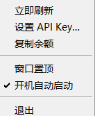

# DeepSeek 余额桌面悬浮窗

一个始终置顶、可拖动、半透明的桌面悬浮小插件，实时显示你的 DeepSeek 账户余额。

## 效果预览


## 它读取的是什么数据？

你给的网址 `https://platform.deepseek.com/usage` 是登录后展示余额的页面，需要登录会话、无法直接被程序抓取。
本插件读取的是 DeepSeek **官方余额接口** `https://api.deepseek.com/user/balance`，它返回的余额与 usage 页面上显示的一致。
因此需要你提供一把 **API Key**（免费创建，见下方）。

## 运行方式

需要 Windows 10 / 11（自带 Edge WebView2 运行时，正常情况下无需额外安装）和 Python 3.9+。

先安装依赖：

```
pip install -r requirements.txt
```

**推荐双击 `启动.vbs`**——它优先使用 `venv\Scripts\pythonw.exe`，不存在时自动改用系统 `pythonw.exe`，不会弹出黑色命令行窗口。

如果习惯用命令行，也可以手动运行：

```
pythonw main.py
```

> 注意：建议用 `pythonw.exe`（无控制台），不要用 `python.exe`，否则会多出一个黑框。

## 第一次使用：填入 API Key

1. 打开 https://platform.deepseek.com/api_keys ，创建一个 API Key（形如 `sk-...`）。
2. 悬浮窗右上角点 ⚙ 打开设置，粘贴 API Key，设置刷新间隔（秒，最小 5），点「保存」。
3. 余额会立即刷新并开始按间隔实时更新。



Key 仅保存在本地 `config.json` 中，且该文件已被 `.gitignore` 排除，不会上传到 GitHub 或任何第三方。

## 操作

- 拖动标题栏「DeepSeek 余额」可移动窗口。
- `—` 最小化，`✕` 关闭。
- 窗口默认始终置顶（on_top），始终浮在其他窗口之上。
- 设置里可改刷新间隔。

## 文件说明

- `main.py`      —— 悬浮窗主程序（pywebview 无边框/置顶/透明窗口 + 服务端余额请求）
- `widget.html`  —— 悬浮窗界面（莫兰迪玻璃拟态风格，实时刷新）
- `config.json`  —— 配置（api_key、refresh_interval），仅保存在本地，不入库
- `requirements.txt` —— Python 依赖（pywebview、requests）

## 故障排查

- 显示「HTTP 401」：API Key 无效或已删除，去 api_keys 页面重新生成并保存。
- 窗口空白：确认系统是 Windows 10/11 且 Edge WebView2 可用（可在微软官网下载「WebView2 运行时」）。
- 想修改默认位置/尺寸：编辑 `main.py` 中 `create_window` 的 `width/height` 与 `on_loaded` 里的 `window.move(...)`。
